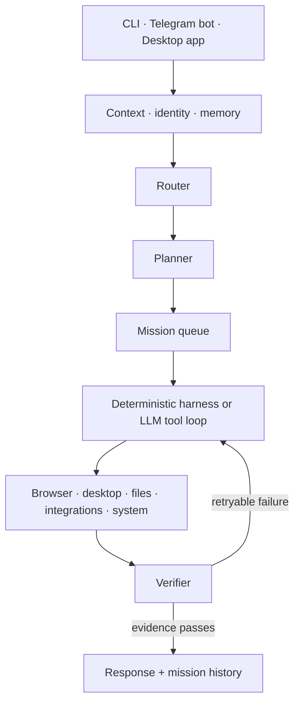

<div align="center">
  

  <h1>HeyAgent</h1>

  <p>
    <strong>A local AI agent that can see, understand, and operate your computer.</strong>
  </p>

  <p>
    Control it from the terminal, the desktop app, or your phone through Telegram.
  </p>

  <p>
    
    
    
    
    
  </p>
</div>

---

HeyAgent is a local-first desktop agent for real work: it opens applications, controls the browser, reads the screen, works with files, creates Google Workspace documents, and can hold a conversation in Telegram Desktop while you control it remotely from a Telegram bot.

It is Russian-first and typo-tolerant, but works with English requests as well.

> [!IMPORTANT]
> HeyAgent can interact with your actual desktop, browser profile, files, and connected services. Review the [security model](#security-and-permissions) before enabling broad permissions.

## Why HeyAgent?

Most assistants stop at chat, shell commands, or isolated browser sandboxes. HeyAgent connects those capabilities to the computer you already use:

- **Real desktop control** — mouse, keyboard, windows, screenshots, applications, and system settings.
- **Browser automation** — works with open tabs and can use your real Chrome, Edge, or Yandex Browser profile.
- **Telegram from your phone** — send a task to your bot and let the gateway perform it on your PC.
- **Telegram Desktop conversations** — send a message to a contact, wait for replies, and continue until the configured goodbye condition.
- **Google Workspace** — create and read Docs, search Drive, create Sheets and Slides, and read today’s Calendar events.
- **Persistent identity and memory** — agent name, pixel avatar, persona, sessions, mission history, and workspace memory.
- **Deterministic orchestration** — route → plan → harness/tool loop → verification, with queueing and loop protection.
- **Model choice and failover** — cloud providers, AWS Bedrock, OpenRouter-compatible services, and local Ollama models.
- **Safe voice degradation** — ElevenLabs is optional; unavailable or rejected voice requests silently fall back to text.

## Contents

- [Requirements](#requirements)
- [Quick start](#quick-start)
- [Using HeyAgent](#using-heyagent)
- [Telegram setup](#telegram-setup)
- [Google Workspace setup](#google-workspace-setup)
- [Other integrations](#other-integrations)
- [Voice replies](#voice-replies)
- [Desktop application](#desktop-application)
- [Configuration](#configuration)
- [Security and permissions](#security-and-permissions)
- [Architecture](#architecture)
- [Development and release checks](#development-and-release-checks)
- [Troubleshooting](#troubleshooting)

## Requirements

### Required

- [Node.js](https://nodejs.org/) **22 or newer**
- npm
- Git

### Recommended

- **Windows 10 or Windows 11** for the most complete desktop-control experience
- Chrome, Microsoft Edge, or Yandex Browser
- Telegram Desktop if you want HeyAgent to message your contacts through the desktop app
- At least one supported LLM provider API key, AWS Bedrock access, or a local Ollama model

### Optional packages on macOS and Linux

```bash
# macOS
brew install cliclick

# Debian/Ubuntu
sudo apt install xdotool wmctrl xclip espeak-ng brightnessctl
```

On macOS, grant Accessibility and Screen Recording permissions to the terminal or application that runs HeyAgent.

## Quick start

### 1. Install and build

```bash
git clone <YOUR_HEYAGENT_REPOSITORY_URL>
cd HeyAgent
npm install
npm run build
```

You can also use the platform quick-start scripts:

```powershell
# Windows
scripts\quickstart-windows.bat
```

```bash
# macOS / Linux
bash scripts/quickstart-unix.sh
```

### 2. Create your agent

```bash
npx hey onboard
```

Onboarding configures the interface language, agent name, pixel avatar, persona, and default model.

### 3. Connect a model

Example with OpenAI:

```bash
npx hey models auth openai
npx hey models set openai/gpt-4.1
npx hey models test
```

Inspect all available providers and model aliases:

```bash
npx hey models list
npx hey models aliases
```

For a local model:

```bash
npx hey models set ollama/llama3.2
```

Ollama must already be installed and running.

### 4. Run your first task

```bash
npx hey ask "Открой блокнот и напиши список покупок"
```

For an ongoing terminal conversation:

```bash
npx hey chat
```

### 5. Start the gateway

The gateway is required for the desktop app, Telegram bot, cron jobs, and background missions:

```bash
npx hey gateway start
```

The local API listens on `http://127.0.0.1:28789` by default.

## Using HeyAgent

Talk naturally. You do not need to memorize tool names.

```text
Открой YouTube и найди хороший урок по дробям
Пройди открытый тест по математике
Создай в Google Docs реферат о квантовой криптографии
Сделай таблицу расходов в Google Sheets
Напиши в Telegram маме привет и поговори с ней
Установи громкость на 30 процентов
Каждый день в 9 утра готовь краткий дайджест
```

### CLI commands

| Command | Purpose |
|---|---|
| `npx hey onboard [--locale ru\|en]` | Create or update the agent identity |
| `npx hey avatars` | Show the pixel avatar gallery |
| `npx hey chat [sessionId]` | Start or continue an interactive session |
| `npx hey ask "task"` | Run one task |
| `npx hey status` | Show identity and configuration status |
| `npx hey models list` | List model providers |
| `npx hey models auth <provider>` | Save provider credentials locally |
| `npx hey models set <provider/model>` | Select the default model |
| `npx hey models test` | Test the selected model |
| `npx hey models fallbacks` | Manage model failover |
| `npx hey connect <service>` | Connect Google, Gmail, Notion, or GitHub |
| `npx hey integrations status` | Check integrations |
| `npx hey telegram setup` | Save a Telegram bot token |
| `npx hey telegram pair` | Restrict the bot to your chat |
| `npx hey telegram status` | Check bot and gateway status |
| `npx hey voice` | Configure ElevenLabs and reply mode |
| `npx hey gateway start\|stop\|restart` | Manage the local gateway |
| `npx hey daemon install` | Print platform auto-start instructions |
| `npx hey eval --all` | Run the deterministic evaluation pack |
| `npx hey metrics` | Show harness success metrics |

Inside `npx hey chat`, use `/help` to see session commands such as model, avatar, mode, voice, status, and exit controls.

## Telegram setup

Telegram gives you a remote control for the computer running HeyAgent.

### 1. Create a bot

1. Open [@BotFather](https://t.me/BotFather).
2. Run `/newbot`.
3. Choose a name and username.
4. Copy the bot token.

### 2. Save the token

```bash
npx hey telegram setup
```

Never commit or publish the bot token. If it leaks, revoke it through BotFather.

### 3. Pair your personal chat

1. Open your bot and send `/start`.
2. Run:

```bash
npx hey telegram pair
```

Pairing stores the allowed Telegram chat ID so random users cannot control your computer.

### 4. Start the gateway

```bash
npx hey gateway start
npx hey telegram status
```

Keep the computer awake and the gateway running while using the bot.

> [!NOTE]
> A Telegram bot receives your remote commands. Requests such as “write to Alex in Telegram” can then operate **Telegram Desktop on the PC**, including waiting for the contact’s reply.

## Google Workspace setup

HeyAgent uses OAuth 2.0 and Google’s official APIs. Setup is free for normal personal use, but you must create a Google Cloud project and enable every Workspace API that HeyAgent calls.

### What the Google connection enables

| Component | HeyAgent capability | API to enable |
|---|---|---|
| Google Drive | Search and manage accessible Drive files | [Google Drive API](https://console.cloud.google.com/apis/library/drive.googleapis.com) |
| Google Docs | Create, read, and format native documents | [Google Docs API](https://console.cloud.google.com/apis/library/docs.googleapis.com) |
| Google Sheets | Create and format spreadsheets | [Google Sheets API](https://console.cloud.google.com/apis/library/sheets.googleapis.com) |
| Google Slides | Create and format presentations | [Google Slides API](https://console.cloud.google.com/apis/library/slides.googleapis.com) |
| Google Calendar | Read events from the primary calendar | [Google Calendar API](https://console.cloud.google.com/apis/library/calendar-json.googleapis.com) |

> [!WARNING]
> Enabling only the Drive API is not enough. Docs, Sheets, Slides, and Calendar are separate APIs and must be enabled individually in the **same Google Cloud project** as the OAuth client.

### Step 1 — Create or select a Google Cloud project

1. Open the [Google Cloud Console](https://console.cloud.google.com/).
2. Use the project selector at the top of the page.
3. Create a project, for example `HeyAgent Local`.
4. Make sure that project remains selected during all following steps.

Official reference: [Create a Google Cloud project](https://developers.google.com/workspace/guides/create-project).

### Step 2 — Enable all required Workspace APIs

Open **APIs & Services → Library**, find each API from the table above, and click **Enable**.

If you use the Google Cloud CLI, the equivalent command is:

```bash
gcloud services enable \
  drive.googleapis.com \
  docs.googleapis.com \
  sheets.googleapis.com \
  slides.googleapis.com \
  calendar-json.googleapis.com
```

Official reference: [Enable Google Workspace APIs](https://developers.google.com/workspace/guides/enable-apis).

### Step 3 — Configure the OAuth consent screen

In the current Google Cloud interface, open **Google Auth Platform**:

1. **Branding** — set the application name to `HeyAgent`, select a support email, and add developer contact information.
2. **Audience**:
   - choose **Internal** only if the project belongs to your Google Workspace organization and every user is inside that organization;
   - otherwise choose **External**.
3. For an External application in **Testing**, add the Google account you will connect under **Test users**.
4. Under **Data Access**, add or review the scopes requested by HeyAgent:

```text
https://www.googleapis.com/auth/documents
https://www.googleapis.com/auth/drive
https://www.googleapis.com/auth/calendar
https://www.googleapis.com/auth/spreadsheets
https://www.googleapis.com/auth/presentations
```

For private testing, keeping the app in Testing mode and adding your own account as a test user is usually sufficient. Testing-mode authorizations can expire after seven days, so you may occasionally need to run `npx hey connect google` again.

For public distribution, sensitive scopes can require Google OAuth verification. Request only the scopes the product actually needs and follow Google’s [OAuth verification guidance](https://support.google.com/cloud/answer/13463073).

### Step 4 — Create a Desktop OAuth client

1. Open **Google Auth Platform → Clients** or **APIs & Services → Credentials**.
2. Click **Create client** / **Create credentials → OAuth client ID**.
3. Select application type **Desktop app**.
4. Name it, for example `HeyAgent Desktop`.
5. Create the client.
6. Click **Download JSON**.

The downloaded file is normally named `client_secret_....json` and contains an `installed` section.

> [!IMPORTANT]
> Download the complete JSON file. A copied Client ID by itself is not enough.

HeyAgent uses the recommended OAuth flow for installed applications with PKCE and a local loopback callback:

```text
http://127.0.0.1:19876
```

A **Desktop app** client normally handles loopback redirects without manually adding an authorized redirect URI. If you intentionally created a **Web application** client instead, add the callback exactly as shown above; otherwise Google will return `redirect_uri_mismatch`.

Official reference: [OAuth 2.0 for Desktop apps](https://developers.google.com/identity/protocols/oauth2/native-app).

### Step 5 — Connect HeyAgent

Leave the downloaded JSON in your Downloads folder and run:

```bash
npx hey connect google
```

HeyAgent searches common download folders automatically. You can also pass an explicit path:

```powershell
npx hey connect google "C:\Users\YourName\Downloads\client_secret_123.json"
```

```bash
npx hey connect google "$HOME/Downloads/client_secret_123.json"
```

The command will:

1. start a temporary callback listener on `127.0.0.1:19876`;
2. open Google in your default browser;
3. ask you to choose an account and approve the requested scopes;
4. exchange the authorization code with PKCE;
5. store the resulting tokens locally under `~/.heyagent/credentials/`.

Do not close the terminal until the browser reports that authorization is complete.

### Step 6 — Verify the connection

```bash
npx hey integrations status
```

Then try:

```bash
npx hey ask "Создай в Google Docs документ с заголовком Проверка HeyAgent"
npx hey ask "Найди в Google Drive документы про криптографию"
npx hey ask "Покажи события Google Calendar на сегодня"
```

### Gmail is connected separately

The Google Workspace OAuth connection above intentionally does **not** request Gmail scopes. Gmail uses a separate app-password flow:

1. Enable two-step verification on the Google account.
2. Open [Google App Passwords](https://myaccount.google.com/apppasswords).
3. Create an app password for mail.
4. Run:

```bash
npx hey connect gmail
```

Enter the Gmail address and generated 16-character app password. Do not enter your normal Google account password.

### Google troubleshooting

<details>
<summary><strong>Access blocked / Error 403: access_denied</strong></summary>

- Confirm the OAuth app’s audience is correct.
- If the app is in Testing, add the account under **Test users**.
- Confirm you are signing in with that exact account.
- Workspace administrators may need to allow the application.
</details>

<details>
<summary><strong>Error 403: API has not been used or is disabled</strong></summary>

Enable the API named in the error inside the same project that owns the OAuth client. Wait a minute, then retry. Remember that Drive, Docs, Sheets, Slides, and Calendar are five separate APIs.
</details>

<details>
<summary><strong>redirect_uri_mismatch</strong></summary>

- Prefer an OAuth client of type **Desktop app**.
- Do not paste only a Client ID; download the complete JSON.
- If using a Web client, configure `http://127.0.0.1:19876` exactly.
- Make sure port `19876` is not occupied by another process.
</details>

<details>
<summary><strong>OAuth timeout</strong></summary>

The callback waits for five minutes. Run `npx hey connect google` again, complete consent promptly, and allow Node.js through the local firewall if prompted.
</details>

<details>
<summary><strong>The connection worked and later expired</strong></summary>

External OAuth apps in Testing can require reauthorization after seven days. Run `npx hey connect google` again. Public multi-user distribution may require moving the app to Production and completing Google verification.
</details>

## Other integrations

### Notion

1. Create an integration at [notion.so/my-integrations](https://www.notion.so/my-integrations).
2. Share the target pages/databases with that integration.
3. Run:

```bash
npx hey connect notion
```

### GitHub

Create a personal access token with only the permissions required for your intended workflow:

```bash
npx hey connect github
```

### Integration status

```bash
npx hey integrations status
```

## Voice replies

Voice output is optional:

```bash
npx hey voice
```

HeyAgent supports ElevenLabs for CLI and Telegram voice replies. If the configured voice does not exist, it retries with a default voice. Authentication, quota, or billing failures automatically switch the affected channels back to text without printing provider error payloads into the conversation.

Telegram voice-message transcription requires an OpenAI API key for Whisper:

```bash
npx hey models auth openai
```

## Desktop application

Build the project first, start the gateway, then launch Electron:

```bash
npm run build
npx hey gateway start
```

In another terminal:

```bash
npm run dev:desktop
```

The desktop companion provides chat, missions, model status, integration status, approvals, and a tray menu.

## Configuration

HeyAgent stores local state under:

```text
~/.heyagent/
├── config.json
├── identity.json
├── credentials/
├── sessions/
├── workspace/
│   ├── SOUL.md
│   ├── AGENTS.md
│   └── MEMORY.md
└── screenshots/
```

- Credentials and OAuth tokens stay outside the repository.
- `.env` is optional; interactive `hey models auth` and `hey connect` commands are preferred.
- Never commit `~/.heyagent`, OAuth JSON files, bot tokens, app passwords, or provider keys.

### Browser profile

HeyAgent uses a real browser profile by default so existing logins and tabs are available. Attaching to the profile can restart the browser with session restoration.

To use a disposable guest profile:

```json
{
  "features": {
    "browserRealProfile": false
  }
}
```

Or set:

```bash
HEYAGENT_BROWSER_GUEST=1
```

### Gateway port

```json
{
  "gateway": {
    "host": "127.0.0.1",
    "port": 28789
  }
}
```

Keep the gateway bound to loopback unless you understand the security implications of exposing it to a network.

## Security and permissions

HeyAgent is powerful by design. Its default policy is intended to allow normal reversible work while requiring approval for sensitive or irreversible actions.

Available policy modes:

```text
ask        — ask before sensitive tools
risky      — ask before irreversible/high-risk actions
allowlist  — permit only explicitly listed capabilities
full       — broad access; use only in a controlled environment
```

Recommended practices:

- Pair the Telegram bot with only your own chat.
- Keep the gateway on `127.0.0.1`.
- Use minimum OAuth scopes and minimum token permissions.
- Prefer a dedicated Google Cloud project for HeyAgent.
- Keep secrets out of the repository and screenshots.
- Review approval prompts before file deletion, shell execution, messages, or account changes.
- Use a disposable browser profile when you do not need personal sessions.
- Do not run as administrator unless a specific operation requires it.

Windows administrator mode is opt-in:

```json
{
  "features": {
    "requireAdmin": true
  }
}
```

## Architecture



The monorepo is organized into focused packages:

```text
apps/
├── cli/                 terminal interface
├── desktop/             Electron companion
└── gateway/             local API, Telegram polling, cron, missions

packages/
├── agent/               runtime, harnesses, tools, memory, evals
├── channels-telegram/   bot transport, long polling, voice STT
├── computer/            desktop, browser, screen, system controls
├── identity/            onboarding, avatars, workspace soul files
├── integrations/        Google Workspace, Gmail, Notion, GitHub
├── models/              providers, validation, model failover
├── orchestrator/        routing, planning, queue, verification
├── policy/              capability and approval policies
└── shared/              configuration and shared types
```

## Platform support

| Capability | Windows | macOS | Linux |
|---|:---:|:---:|:---:|
| Files, shell, HTTP, downloads | ✅ | ✅ | ✅ |
| Browser automation | ✅ | ✅ | ✅ |
| Mouse, keyboard, screenshots | ✅ | ✅ | ✅ |
| Telegram bot gateway | ✅ | ✅ | ✅ |
| Telegram Desktop automation | ✅ | ✅ | ✅ |
| System controls | Best coverage | Partial | Partial |
| Electron companion | ✅ | ✅ | ✅ |

Windows is the primary and most thoroughly tested platform.

## Development and release checks

```bash
npm run build
npm run lint
npm test
```

Additional useful commands:

```bash
npm run dev           # gateway watch mode
npm run dev:cli       # CLI through tsx
npm run dev:desktop   # build and launch Electron
npx hey eval --all    # deterministic routing/harness evaluation
npx hey metrics       # local harness success metrics
npm audit --omit=dev
```

CI runs lint, build, and tests on Linux and Windows.

## Troubleshooting

### PowerShell blocks npm scripts

Either allow locally signed scripts for the current user:

```powershell
Set-ExecutionPolicy -Scope CurrentUser -ExecutionPolicy RemoteSigned
```

Or use the `.cmd` shims without changing the policy:

```powershell
npm.cmd install
npm.cmd run build
```

### The Telegram bot does not answer

```bash
npx hey telegram status
npx hey gateway restart
```

Check that:

- the bot token is valid;
- your chat is paired;
- only one gateway instance is polling that bot;
- the computer is awake and online.

### The desktop app says “Gateway offline”

```bash
npx hey gateway start
```

Then verify:

```text
http://127.0.0.1:28789/health
```

### The model does not respond

```bash
npx hey models test
npx hey models list
```

Confirm that the selected provider has valid credentials and that the configured model ID is available to your account.

### ElevenLabs is unavailable

Text replies continue working automatically. Run `npx hey voice` to update the key or voice, or leave reply mode set to text.

## OpenClaw attribution

HeyAgent includes infrastructure ideas and MIT-licensed portions derived from OpenClaw, including model failover, session queueing, tool-loop protection, and workspace identity files. OpenClaw is **not** a runtime dependency and is not embedded as a vendor repository.

See [THIRD_PARTY_NOTICES.md](./THIRD_PARTY_NOTICES.md) for attribution.

## License

HeyAgent is available under the [GNU Affero General Public License v3.0](./LICENSE).
